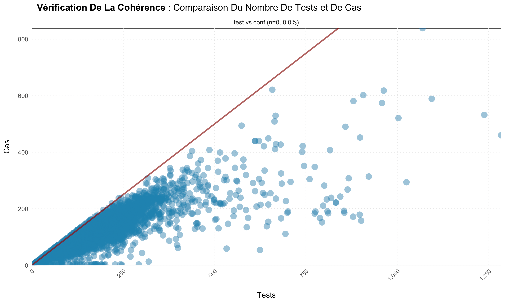
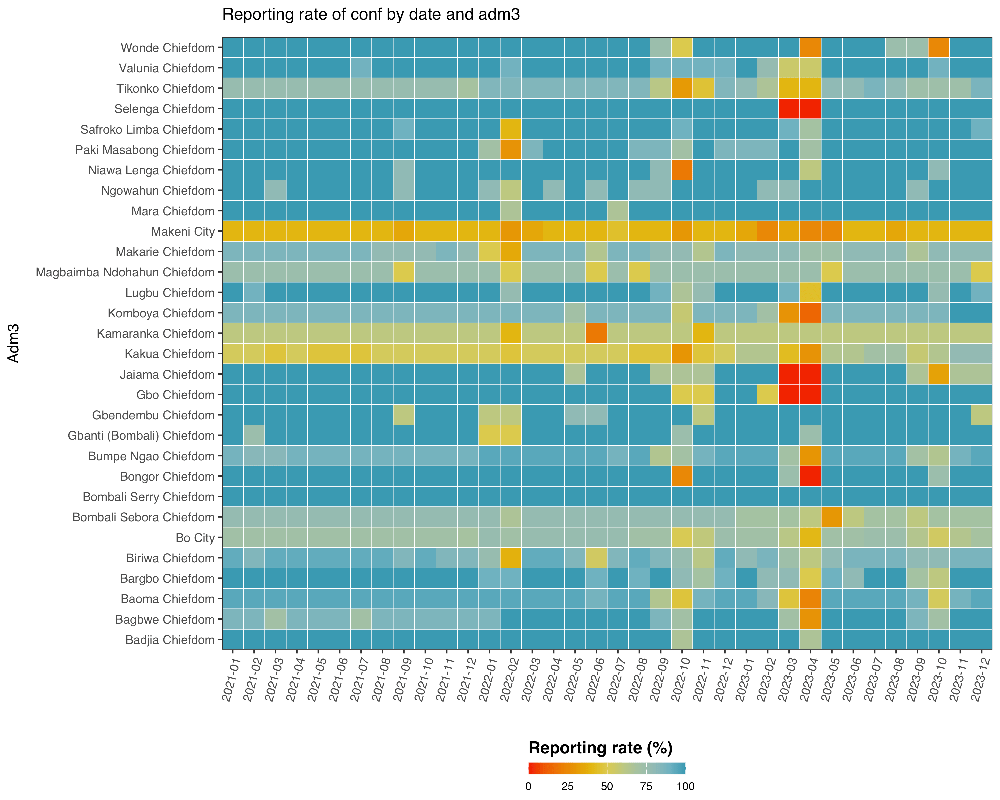
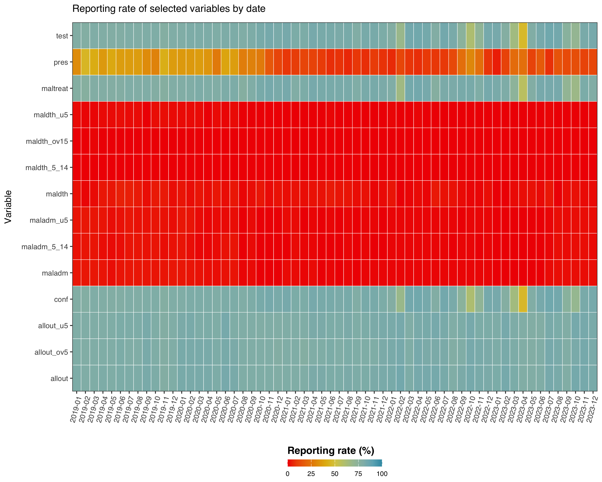

# sntutils


## What is sntutils?

`sntutils` is an R package developed by AHADI to support the Subnational
Tailoring (SNT) of malaria interventions. It provides utility functions
that standardize and streamline data preparation, cleaning, management,
visualization, and analysis, facilitating evidence-based decision-making
at district level or below. This is an overview of the available
functions in this version of `sntutils`:

| Category                      | Function                        | Description                                                               |
|-------------------------------|---------------------------------|---------------------------------------------------------------------------|
| **Data Import/Export**        | `read()`                        | Reads data from various file formats (CSV, Excel, Stata, RDS, shapefiles) |
|                               | `write()`                       | Exports data to various file formats                                      |
| **Date Handling**             | `autoparse_dates()`             | Automatically detects and standardizes various date formats               |
|                               | `available_date_formats`        | List of supported date formats for parsing                                |
| **Geolocation Name Cleaning** | `prep_geonames()`               | Standardizes administrative names across different levels                 |
| **Data Aggregation**          | `calculate_reporting_metrics()` | Aggregates facility reporting/missing rates over time and space           |
| **Data Visualization**        | `consistency_check()`           | Identifies inconsistencies between two variables in a data                |
|                               | `reporting_rate_plot()`         | Visualizes reporting/missing rates by two variables                       |
| **Translation**               | `translate_text()`              | Translates text with persistent file cache                                |
|                               | `translate_text_vec()`          | Vectorized version of `translate_text` function                           |
|                               | `translate_yearmon()`           | Converts date to yearmon format with month names in multiple languages    |
| **Image Processing**          | `compress_png()`                | Reduces PNG file size while maintaining quality                           |
| **Numeric Utilities**         | `big_mark()`                    | Formats numbers with thousand separators                                  |
|                               | `sum2()`                        | Sum with automatic NA removal                                             |
|                               | `mean2()`                       | Mean with automatic NA removal                                            |
|                               | `median2()`                     | Median with automatic NA removal                                          |
| **Hashing Utilities**         | `vdigest()`                     | Vectorized version of digest::digest function                             |

## :wrench: Installation

The package can be installed using `devtools` in R. The steps are as
follows:

``` r
# 1) Install devtools if you haven't already
install.packages("devtools")

# 2) Install the sntutils package from GitHub
devtools::install_github("ahadi-analytics/sntutils")
```

## :book: Usage

### Data Import and Export

The `read()` and `write()` functions provide a simplified interface for
importing and exporting data in various formats, inspired by the `rio`
package.

``` r
# Load the sntutils package
library(sntutils)

# Import data in various formats
df_csv <- read("path/to/file.csv", sep = ",")
df_excel <- read("path/to/file.xlsx", sheet = 1)
df_excel2 <- read("path/to/file.xls", sheet = 1)
df_stata <- read("path/to/file.dta")
df_spss <- read("path/to/file.sav")
df_rds <- read("path/to/file.rds")

# Import spatial data
sf_geojson <- read("path/to/file.geojson")
sf_shapefile <- read("path/to/file.shp")

# Export data to different formats
write(df, "path/to/export.csv")
write(df, "path/to/export.xlsx")
write(df, "path/to/export.xls")
write(df, "path/to/export.dta")
write(df, "path/to/export.rds")

# Export spatial data
write(sf_data, "path/to/export.shp")
write(sf_data, "path/to/export.geojson")

# Export multiple datasets as sheets in Excel
write(
  list(data1 = df1, data2 = df2, data3 = df3),
  "path/to/multi_sheet.xlsx"
)
```

### Automatic Date Parsing

The `autoparse_dates()` function parses and standardizes date columns in
a data frame, ensuring consistency in date formats. This is particularly
useful when working with datasets containing multiple date formats or
ambiguous date entries.

``` r
# Example with mixed date formats
df <- data.frame(
  mixed_dates = c("2023-10-03", "11.09.2022", "25-12-21 23:59", "2020-08-15T00:00:00Z"),
  iso8601_dates = c("2021-03-20T00:01:00.513+01:00", "2022-11-05T23:15:59.123Z")
)

# Parse dates to standard format
parsed_df <- autoparse_dates(
  data = df,
  date_cols = c("mixed_dates", "iso8601_dates"),
  output_format = "%Y-%m-%d"
)

parsed_df$mixed_dates
#> [1] "2023-10-03" "2022-09-11" "2021-12-25" "2020-08-15"

parsed_df$iso8601_dates
#> [1] "2021-03-20" "2022-11-05"

# With custom format output
parsed_df <- autoparse_dates(
  data = df,
  date_cols = c("mixed_dates", "iso8601_dates"),
  output_format = "%d/%m/%Y"
)

parsed_df$mixed_dates
#> [1] "03/10/2023" "11/09/2022" "25/12/2021" "15/08/2020"
```

### Geolocation Name Cleaning

The `prep_geonames()` function combines algorithmic matching with user
interactivity to clean and standardize administrative names. It uses
string distance calculations for initial matching and allows users to
make final corrections interactively, with all decisions saved for
future use. The function supports a user-provided lookup dataset as a
reference or defaults to internal WHO geonames data if no lookup is
provided. Additionally, it supports hierarchical stratification across
up to six administrative levels. It also caches user decisions to
improve consistency and efficiency in subsequent sessions. For users who
prefer to run the code without interactivity, the function can be
executed with `interactive = FALSE`.

``` r
# Example data with inconsistent admin names
dhis2_dummy <- data.frame(
  country = c("ANGOLA", "UGA", "ZAMBIA", "KEN"),
  province = c("CABONDA", "TESO", "LUSAKA", "NAIROBY"),
  district = c("BALIZE", "BOKEDEA", "RAFUNSA", "KIBRA")
)

# custom lookup data
my_lookup <- data.frame(
  country = c("Angola", "Uganda", "Zambia", "Kenya"),
  province = c("Cabinda", "Teso", "Lusaka", "Nairobi"),
  district = c("Belize", "Bukedea", "Rufunsa", "Kibera")
)

# Harmonize admin names (interactive mode)
cleaned_df <- prep_geonames(
  target_df = dhis2_dummy,
  lookup_df = my_lookup,
  level0 = "country",
  level1 = "province",
  level2 = "district",
  interactive = TRUE 
)
```

Here is a short video to demonstrate the full interactivity of
`prep_geonames()`:
https://github.com/user-attachments/assets/ffa69a93-a982-43c4-9673-1165f997fd96

### Aggregatign Reporting Rate

The `calculate_reporting_metrics()` function evaluates data completeness
in routine health information systems. It treats both missing (`NA`) and
zero values as non-reported data to provide consistent metrics for
reporting completeness. The function supports three main analytical
scenarios:

**Scenario 1: Reporting Rate by Two Dimensions**

Calculates the frequency of valid (non-missing, non-zero) reports across
two grouping variables (e.g., time period and location) for specified
variables of interest:

``` r
# Example data with inconsistent admin names
sl_dhis2 <- readRDS("inst/extdata/sl_exmaple_dhis2.rds") |> 
  dplyr::filter(date >= "2018.01")

# Calculate reporting rates by date and district
calculate_reporting_metrics(
  data = sl_dhis2,
  vars_of_interest = c("conf", "pres"),  # Confirmed and presumptive malaria cases
  x_var = "date",                        # Time dimension
  y_var = "adm2"                         # Geographic dimension
)
```

    # A tibble: 6 × 7
      date    adm2                     variable   exp   rep reprate missrate
      <chr>   <chr>                    <chr>    <int> <int>   <dbl>    <dbl>
    1 2019-01 Bo City Council          conf        39    25    64.1     35.9
    2 2019-01 Bo City Council          pres        39     7    17.9     82.1
    3 2019-01 Bo District Council      conf       129   108    83.7     16.3
    4 2019-01 Bo District Council      pres       129    43    33.3     66.7
    5 2019-01 Bombali District Council conf        81    72    88.9     11.1
    6 2019-01 Bombali District Council pres        81    35    43.2     56.8

**Scenario 2: Reporting and Missing Rates Over Time**

Analyzes both reporting rates and missing rates across a single
dimension (typically time):

``` r
# Evaluate reporting completeness over time
calculate_reporting_metrics(
  data = sl_dhis2,
  vars_of_interest = c("conf", "pres", "test"),  # Key indicators
  x_var = "date"                                 # Time dimension only
)
```

    # A tibble: 6 × 6
      date    variable   exp   rep reprate missrate
      <chr>   <chr>    <int> <int>   <dbl>    <dbl>
    1 2019-01 conf       269   212    78.8     21.2
    2 2019-01 pres       269    85    31.6     68.4
    3 2019-01 test       269   212    78.8     21.2
    4 2019-02 conf       269   210    78.1     21.9
    5 2019-02 pres       269   121    45.0     55.0
    6 2019-02 test       269   210    78.1     21.9

**Scenario 3: Facility-Level Reporting Proportion**

Measures the proportion of health facilities within each group that
submitted any valid data during each time period:

``` r
# Assess facility-level reporting by district over time
calculate_reporting_metrics(
  data = sl_dhis2,
  vars_of_interest = c("conf", "pres", "test"),  # Any of these variables
  x_var = "date",                                # Time dimension
  y_var = "adm2",                                # Geographic dimension
  hf_col = "hf_uid"                              # Facility identifier
)
```

    # A tibble: 6 × 6
      date    adm2                       exp   rep reprate missrate
      <chr>   <chr>                    <int> <int>   <dbl>    <dbl>
    1 2019-01 Bo City Council             39    25    64.1     35.9
    2 2019-01 Bo District Council        129   108    83.7     16.3
    3 2019-01 Bombali District Council    81    72    88.9     11.1
    4 2019-01 Makeni City Council         20     7    35       65  
    5 2019-02 Bo City Council             39    25    64.1     35.9
    6 2019-02 Bo District Council        129   108    83.7     16.3

### Consistency Check plots

The `consistency_check()` function identifies and visualizes
inconsistencies between two variables such as the test and confirmed
cases, useful for data quality assessment.

``` r
# Check consistency between tests and cases
consistency_check(
  sl_dhis2,
  tests = c("test"),
  cases = c("conf")
)

# save the plot
consistency_check(
  sl_dhis2,
  tests = c("test"),
  cases = c("conf")
  save_plot = TRUE,
  plot_path = "plots/consistency_check_plots"
)

# with translated labels in (French)
consistency_check(
  sl_dhis2,
  tests = c("test"),
  cases = c("conf"),
  target_language = "fr"
)
```



### Reporting Rate Plots

The `reporting_rate_plot()` function plots the reporting rates for
health facility data, making it easy to identify patterns, gaps, and
trends in data completeness across time and geographic areas. This
visualization function works with health facility data, using
`calculate_reporting_metrics()` internally to support all three
reporting scenarios.

**Scenario 1: Reporting rates by date and district**

``` r
reporting_rate_plot(
  sl_dhis2,
  x_var = "date",
  y_var = "adm3",
  vars_of_interest = "conf"
)
```



**Scenario 2: Missing rates over time**

``` r
# get the variables of interest
vars <- c("conf", "test", "pres", "allout", 
         "maladm", "maldth", "maltreat", "allout_u5", 
         "allout_ov5", "maladm_u5", "maladm_5_14", 
         "maldth_u5", "maldth_5_14", "maldth_ov15")

reporting_rate_plot(
  sl_dhis2,
  x_var = "date",
  vars_of_interest = vars
)
```



**Scenario 3: Facility-level reporting proportion**

``` r
reporting_rate_plot(
  data = sl_dhis2,
  vars_of_interest = c("conf"),
  x_var = "date",
  y_var = "adm3",
  hf_col = "hf_uid",
    target_language = "fr" # This time we translate it to French
)
```


### Image Compression

In cases where output file size—such as for PDFs or Word
documents—becomes a concern, compressing images can significantly reduce
size without noticeably affecting quality. The `compress_png()` function
helps with this by reducing PNG file sizes while preserving visual
fidelity.

Both `reporting_rate_plot()` and `consistency_check()` include built-in
support for image compression during saving. Additionally, users can
manually compress individual PNGs or entire folders using
`compress_png()`:

``` r
# Compress a single PNG file
compress_png(
  "path/to/large_image.png",
  output_path = "path/to/consistency_plot.png"
)

#> ── Compression Summary ──
#> 
#> ✔ Successfully compressed: consistency_plot.png
#> ℹ Total compression: 200.21 KB (71.54% saved)
#> ℹ Excellent compression!
#> 
#> ── File Size 
#> Before compression: 279.87 KB
#> After compression: 79.66 KB

# Compress all PNGs in a directory
compress_png(
  "path/to/image_folder/",
  output_path = "path/to/compressed_folder/"
  verbose = TRUE
)
```

### Text Translation with Caching

The `translate_text()` function uses Google Translate API through the
`gtranslate` package and implements a sophisticated caching system to
improve efficiency and consistency for future usage:

``` r
# Translate a single text from English to French
translate_text("Reporting rate by district", 
               target_language = "fr", 
               source_language = "en")
#> "Taux de rapportage par district"

# Translate with custom cache location
translate_text("Malaria cases", 
               target_language = "pt",  # Portuguese
               cache_path = "~/translation_cache")
#> "Casos de malária"
```

For bulk translation of multiple strings, the vectorized version
`translate_text_vec()` offers better performance and works easily with
data frames when used in a piped workflow:

``` r
library(dplyr)

df <- tibble::tibble(
  label = c("Confirmed cases", "Presumed cases", "Tests performed")
)

df |>
  dplyr::mutate(label_es = translate_text_vec(label, target_language = "es"))
```

    # A tibble: 3 × 2
      label           label_es          
      <chr>           <chr>             
    1 Confirmed cases Casos confirmados 
    2 Presumed cases  Casos presuntos   
    3 Tests performed Pruebas realizadas

When working with time series data, properly formatting dates in the
local language improves report readability. The `translated_yearmon()`
function supports this by using locale-aware month-year formatting:

``` r
# Convert dates to localized month-year format
dates <- seq(as.Date("2022-01-01"), as.Date("2022-03-01"), by = "month")

# French localized dates
translated_yearmon(dates, language = "fr")
#> [1] "janv. 2022" "févr. 2022" "mars 2022"

# Full month names in Spanish
translated_yearmon(dates, language = "es", format = "%B %Y")
#> [1] "enero 2022" "febrero 2022" "marzo 2022"
```

### Numeric Formatting

Several helper functions make working with numeric data easier:

``` r
# Format numbers with thousands separator
big_mark(1234567.89)
#> [1] "1,234,567.89"

big_mark(c(1234.56, 7890123.45), decimals = 1, big_mark = " ")
#> [1] "1 234.6" "7 890 123.5"

# NA-safe numeric functions
sum2(c(1, 2, NA, 4))  # Sum with automatic NA removal
#> [1] 7

mean2(c(1, 2, NA, 4))  # Mean with automatic NA removal
#> [1] 2.333333

median2(c(1, 2, NA, 4, 5))  # Median with automatic NA removal
#> [1] 3
```

### Vectorized Digest for Efficient Data Hashing

The `vdigest()` function provides a vectorized implementation of the
`digest::digest()` function, making it efficient to generate hash values
for entire columns or vectors in a data frame. This is particularly
useful for creating unique identifiers, tracking data changes, or
anonymizing sensitive information.

``` r
sl_dhis2 |>
  dplyr::distinct(adm3) |> 
  dplyr::mutate(
    # Hash personal identifiers
    adm3_hash = vdigest(adm3)
  ) |> head()
```

    # A tibble: 6 × 2
      adm3             adm3_hash                       
      <chr>            <chr>                           
    1 Bo City          c810b59ec12efb2ac8b5cc84f46857ce
    2 Kakua Chiefdom   27fd84f751fac150c2f8a8f42b71c3da
    3 Baoma Chiefdom   462ef3c87dc9b40b2ec2e0e0a54dd63e
    4 Valunia Chiefdom df394518e6987ed686d76e83a409f090
    5 Bagbwe Chiefdom  3aa7a61247e34ab397ff813fe520c8b7
    6 Wonde Chiefdom   196dc9792e2038b41411ec2afae37e61

These translation functions are integrated throughout the package,
allowing functions like `reporting_rate_plot()` and
`consistency_check()` to generate outputs in the users preferred
language through their `target_language` parameter.

## :handshake: Contribution

Contributions to `sntutils` are welcome! Please feel free to submit
issues or pull requests on our [GitHub
repository](https://github.com/ahadi-analytics/sntutils).

## License

This package is licensed under CC BY 4.0.
