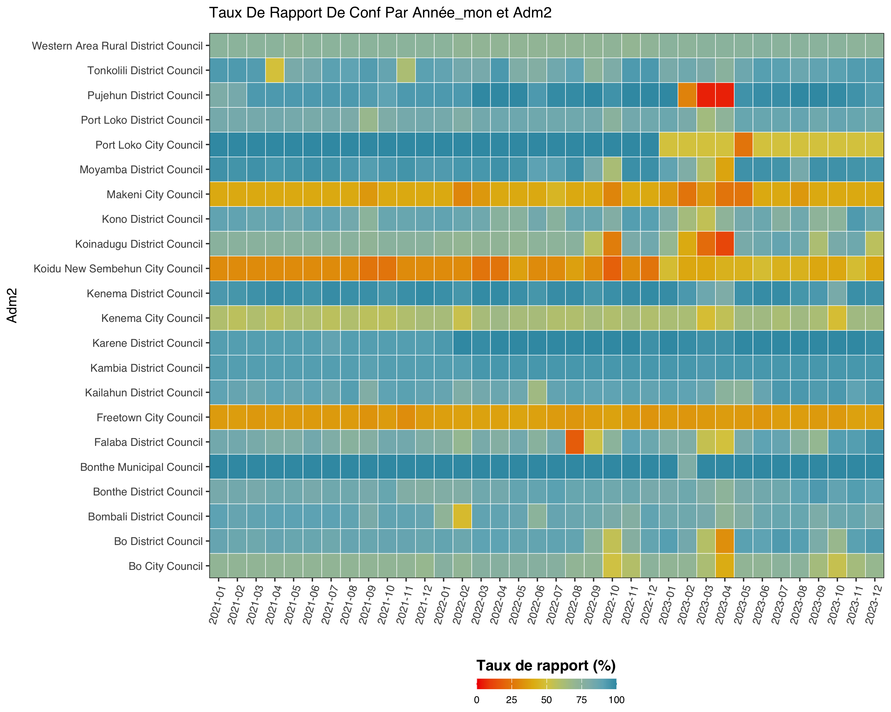
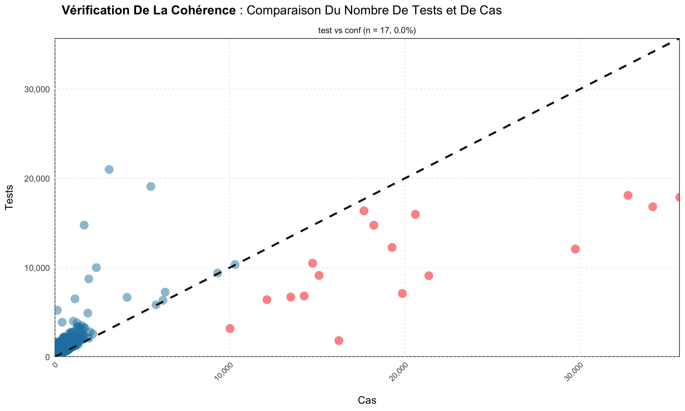
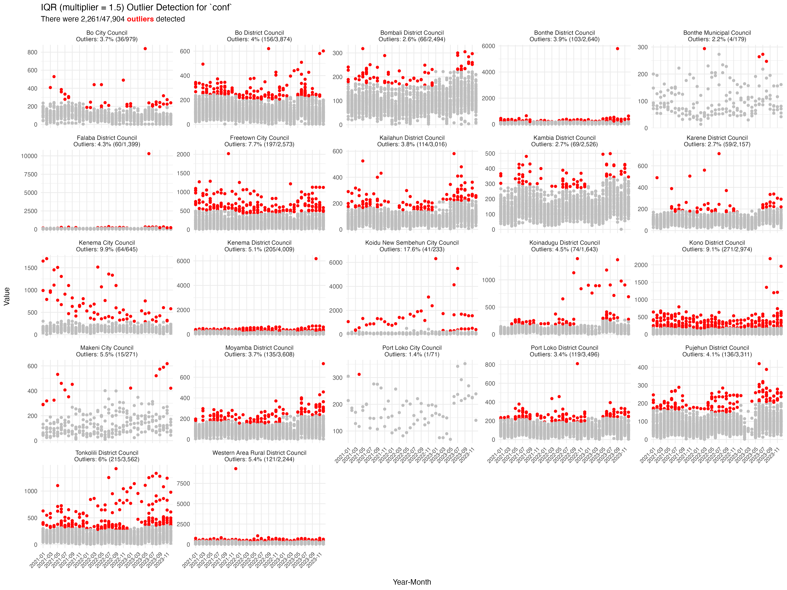

# sntutils

## What is sntutils?

`sntutils` is an R package developed by AHADI to support the Subnational
Tailoring (SNT) of malaria interventions. It provides utility functions
that standardize and streamline data preparation, cleaning, management,
visualization, and analysis, facilitating evidence-based decision-making
at district level or below. This is an overview of the available
functions in this version of `sntutils`:

| Category                      | Function                         | Description                                                                                |
| ----------------------------- | -------------------------------- | ------------------------------------------------------------------------------------------ |
| **Data Import/Export**        | `read()`                         | Reads data from various file formats (CSV, Excel, Stata, RDS, shp)                         |
|                               | `write()`                        | Exports data to various file formats                                                       |
| **Download Chirps Data**      | `download_chirps2.0()`           | Downloads monthly CHIRPS rainfall rasters for a given region and date range                |
| **Project Structure**         | `create_data_structure()`        | Creates AHADI-style hierarchical data folders under 01_data/                               |
|                               | `initialize_project_structure()` | Sets up full project folder structure with data, scripts, outputs, and reports             |
| **Date Handling**             | `autoparse_dates()`              | Automatically detects and standardizes various date formats                                |
|                               | `available_date_formats`         | List of supported date formats for parsing                                                 |
| **Geolocation Name Cleaning** | `prep_geonames()`                | Standardizes administrative names across different levels                                  |
| **Data Extraction**           | `process_raster_collection()`    | Extract values from multiple rasters against ashapefile                                    |
| **Reporting Rate Checks**     | `calculate_reporting_metrics()`  | Aggregates facility reporting/missing rates over time and space                            |
|                               | `reporting_rate_plot()`          | Visualizes reporting/missing rates by two variables                                        |
| **Outlier Detection**         | `detect_outliers()`              | Flags outliers in a numeric column using mean ± 3 SD, Hampel, and Tukey’s IQR methods      |
|                               | `outlier_plot()`                 | Generates time‐series plots of flagged outliers (faceted by admin area, colored by method) |
| **Consistency Checks**        | `consistency_check()`            | Identifies inconsistencies between two variables in a data vis plotting                    |
| **Translation**               | `translate_text()`               | Translates text with persistent file cache                                                 |
|                               | `translate_text_vec()`           | Vectorized version of `translate_text` function                                            |
|                               | `translate_yearmon()`            | Converts date to yearmon format with month names in multiple langs                         |
| **Image Processing**          | `compress_png()`                 | Reduces PNG file size while maintaining quality                                            |
| **Numeric Utilities**         | `big_mark()`                     | Formats numbers with thousand separators                                                   |
|                               | `sum2()`                         | Sum with automatic NA removal                                                              |
|                               | `mean2()`                        | Mean with automatic NA removal                                                             |
|                               | `median2()`                      | Median with automatic NA removal                                                           |
| **Hashing Utilities**         | `vdigest()`                      | Vectorized version of `digest::digest` function                                            |

## :wrench: Installation

The package can be installed using `devtools` in R. The steps are as
follows:

```r
# 1) Install devtools if you haven't already
install.packages("devtools")

# 2) Install the sntutils package from GitHub
devtools::install_github("ahadi-analytics/sntutils")
```

## :book: Usage

### Data Import and Export

The `read()` and `write()` functions provide a simplified interface for
importing and exporting data in various formats, inspired by the `rio`
package.

```r
# Load the sntutils package
library(sntutils)

# Import data in various formats
df_csv <- read("path/to/file.csv", sep = ",")
df_excel <- read("path/to/file.xlsx", sheet = 1)
df_excel2 <- read("path/to/file.xls", sheet = 1)
df_stata <- read("path/to/file.dta")
df_spss <- read("path/to/file.sav")
df_rds <- read("path/to/file.rds")

# Import spatial data
sf_geojson <- read("path/to/file.geojson")
sf_shapefile <- read("path/to/file.shp")

# Export data to different formats
write(df, "path/to/export.csv")
write(df, "path/to/export.xlsx")
write(df, "path/to/export.xls")
write(df, "path/to/export.dta")
write(df, "path/to/export.rds")

# Export spatial data
write(sf_data, "path/to/export.shp")
write(sf_data, "path/to/export.geojson")

# Export multiple datasets as sheets in Excel
write(
  list(data1 = df1, data2 = df2, data3 = df3),
  "path/to/multi_sheet.xlsx"
)
```

### Downalod Climate Data (CHIRPS Rainfall)

The `download_chirps2.0()` function allows you to fetch CHIRPS monthly
rainfall raster data for any supported region and time period. It pulls
data directly from the [UCSB Climate Hazards
Group](https://www.chc.ucsb.edu/data/chirps) FTP archive and supports
automatic unzipping. Only `.tif.gz` monthly rasters are supported, and
the function avoids re-downloading existing files. To view all supported
CHIRPS datasets, use `chirps_options()`. To check the available years
and months for a specific CHIRPS dataset (e.g., africa_monthly), use the
`check_chirps_available()` function.

```r
# View available CHIRPS datasets
chirps_options()
#># A tibble: 4 × 4
#>  dataset             frequency label                                 subdir
#>  <chr>               <chr>     <chr>                                 <chr>
#>1 global_monthly      monthly   Global (Monthly)                      global_monthly/tifs
#>2 africa_monthly      monthly   Africa (Monthly)                      africa_monthly/tifs
#>3 camer-carib_monthly monthly   Caribbean & Central America (Monthly) camer-carib_monthly/tifs
#>4 EAC_monthly         monthly   East African Community (Monthly)      EAC_monthly/tifs

# check available years and months for the africa_monthly
check_chirps_available(dataset_code = "africa_monthly")

#> ✔ africa_monthly: Data available from Jan 1981 to Mar 2025.
#># A tibble: 531 × 4
#>   file_name                  year  month dataset
#>   <chr>                      <chr> <chr> <chr>
#> 1 chirps-v2.0.2025.01.tif.gz 2025  01    africa_monthly
#> 2 chirps-v2.0.2025.02.tif.gz 2025  02    africa_monthly
#> 3 chirps-v2.0.2025.03.tif.gz 2025  03    africa_monthly
#> 4 chirps-v2.0.2024.01.tif.gz 2024  01    africa_monthly
#> 5 chirps-v2.0.2024.02.tif.gz 2024  02    africa_monthly
#> 6 chirps-v2.0.2024.03.tif.gz 2024  03    africa_monthly
#> 7 chirps-v2.0.2024.04.tif.gz 2024  04    africa_monthly
#> 8 chirps-v2.0.2024.05.tif.gz 2024  05    africa_monthly
#> 9 chirps-v2.0.2024.06.tif.gz 2024  06    africa_monthly
#>10 chirps-v2.0.2024.07.tif.gz 2024  07    africa_monthly

# Download Africa monthly rainfall for Jan to Mar 2022
download_chirps2.0(
  dataset = "africa_monthly",
  start = "2022-01",
  end = "2022-03",
  out_dir = "data/chirps"
)
```

This will download the following files to the data/chirps/ folder (and
unzip them if requested):

- `chirps-v2.0.2022.01.tif`

- `chirps-v2.0.2022.02.tif`

- `chirps-v2.0.2022.03.tif`

### Project and Data Folder Structure Utilities

Two functions are provided to help set up a consistent, hierarchical
folder structure for SNT projects following AHADI’s recommended layout.
Each key data domain in 01_data/ includes two subfolders: raw/ for
storing the original, untouched data as received, and processed/ for
storing cleaned or transformed versions ready for analysis. This
structure is applied consistently across all domains.

**create_data_structure()**

```r
# Create only the data structure under 01_data/
create_data_structure(base_path = ".")
```

```plaintext
01_data/
├── 1.1_foundational/
│   ├── 1.1a_admin_boundaries/
│   ├── 1.1b_health_facilities/
│   └── 1.1c_population/
│       ├── 1.1ci_national/
│       └── 1.1cii_worldpop_rasters/
├── 1.2_epidemiology/
│   ├── 1.2a_routine_surveillance/
│   ├── 1.2b_pfpr_estimates/
│   └── 1.2c_mortality_estimates/
├── 1.3_interventions/
├── 1.4_drug_efficacy_resistance/
├── 1.5_environment/
│   ├── 1.5a_climate/
│   ├── 1.5b_accessibility/
│   └── 1.5c_land_use/
├── 1.6_health_systems/
│   └── 1.6a_dhs/
├── 1.7_entomology/
├── 1.8_commodities/
02_scripts/
03_outputs/
│   └── plots/
04_reports/
metadata_docs/
```

**initialize_project_structure()**

Sets up the full AHADI project structure, including organized folders
for data, scripts, outputs, reports, and metadata. This structure is
purposefully designed to support the full analytical workflow by
ensuring that every project component has a clear, dedicated place. This
organization makes it straightforward to locate files, reduces
confusion, and ensures the project remains traceable, reproducible, and
easy to maintain from start to finish.

```r
# Initialize full project structure at specified path
initialize_project_structure(base_path = "my_snt_project")
```

```plaintext
my_snt_project/
├── 01_data/
│   └── [Hierarchical data folders as above]
├── 02_scripts/
├── 03_outputs/
│   └── plots/
├── 04_reports/
└── metadata_docs/
```

### Automatic Date Parsing

The `autoparse_dates()` function parses and standardizes date columns in
a data frame, ensuring consistency in date formats. This is particularly
useful when working with datasets containing multiple date formats or
ambiguous date entries.

```r
# Example with mixed date formats
df <- data.frame(
  mixed_dates = c("2023-10-03", "11.09.2022", "25-12-21 23:59", "2020-08-15T00:00:00Z"),
  iso8601_dates = c("2021-03-20T00:01:00.513+01:00", "2022-11-05T23:15:59.123Z")
)

# Parse dates to standard format
parsed_df <- autoparse_dates(
  data = df,
  date_cols = c("mixed_dates", "iso8601_dates"),
  output_format = "%Y-%m-%d"
)

parsed_df$mixed_dates
#> [1] "2023-10-03" "2022-09-11" "2021-12-25" "2020-08-15"

parsed_df$iso8601_dates
#> [1] "2021-03-20" "2022-11-05"

# With custom format output
parsed_df <- autoparse_dates(
  data = df,
  date_cols = c("mixed_dates", "iso8601_dates"),
  output_format = "%d/%m/%Y"
)

parsed_df$mixed_dates
#> [1] "03/10/2023" "11/09/2022" "25/12/2021" "15/08/2020"
```

### Geolocation Name Cleaning

The `prep_geonames()` function combines algorithmic matching with user
interactivity to clean and standardize administrative names. It uses
string distance calculations for initial matching and allows users to
make final corrections interactively, with all decisions saved for
future use. The function supports a user-provided lookup dataset as a
reference or defaults to internal WHO geonames data if no lookup is
provided. Additionally, it supports hierarchical stratification across
up to six administrative levels. It also caches user decisions to
improve consistency and efficiency in subsequent sessions. For users who
prefer to run the code without interactivity, the function can be
executed with `interactive = FALSE`.

```r
# Example data with inconsistent admin names
dhis2_dummy <- data.frame(
  country = c("ANGOLA", "UGA", "ZAMBIA", "KEN"),
  province = c("CABONDA", "TESO", "LUSAKA", "NAIROBY"),
  district = c("BALIZE", "BOKEDEA", "RAFUNSA", "KIBRA")
)

# custom lookup data
my_lookup <- data.frame(
  country = c("Angola", "Uganda", "Zambia", "Kenya"),
  province = c("Cabinda", "Teso", "Lusaka", "Nairobi"),
  district = c("Belize", "Bukedea", "Rufunsa", "Kibera")
)

# Harmonize admin names (interactive mode)
cleaned_df <- prep_geonames(
  target_df = dhis2_dummy,
  lookup_df = my_lookup,
  level0 = "country",
  level1 = "province",
  level2 = "district",
  interactive = TRUE
)
```

Here is a short video to demonstrate the full interactivity of
`prep_geonames`:

https://github.com/user-attachments/assets/ffa69a93-a982-43c4-9673-1165f997fd96

### CHIRPS Raster Batch Processing

The `process_raster_collection()` function automates zonal statistics
extraction across multiple raster files (e.g., CHIRPS monthly rainfall
`.tif` files). It detects dates from filenames, aligns CRS between
rasters and shapefiles, and computes statistics like mean, sum, or
median using exact geometry-aware extraction. It returns a tidy data
frame indexed by administrative unit and time.

This is especially useful for climate data workflows that require
aggregating high-resolution rasters to subnational geographies over
time.

```r
# Dummy example — replace with your shapefile and actual raster directory
adm3_shp <- sf::st_read(system.file("extdata", "sle_adm3_example.geojson",
                                    package = "sntutils"))

# Raster files must be named with detectable dates
# (e.g. africa_monthly_chirps-v2.0.2023.05.tif)
# For test purposes, use sample files stored in test fixtures:
raster_dir <- system.file("extdata", "chirps_test_rasters",
                          package = "sntutils")

# Process rasters and extract mean rainfall
rainfall_df <- sntutils::process_raster_collection(
  directory = raster_dir,
  shapefile = adm3_shp,
  id_cols = c("adm0", "adm1", "adm2", "adm3"),
  aggregations = c("mean"),
  pattern = "\.tif$"
)

rainfall_df
#>                                file_name       adm1      adm2          adm3 year month      mean
#>1   africa_monthly_chirps-v2.0.2020.01.tif    EASTERN  KAILAHUN          DEA 2020     1 12.871692
#>2   africa_monthly_chirps-v2.0.2020.01.tif    EASTERN  KAILAHUN         JAHN 2020     1  9.820749
#>3   africa_monthly_chirps-v2.0.2020.01.tif    EASTERN  KAILAHUN        JAWIE 2020     1 12.042542
#>4   africa_monthly_chirps-v2.0.2020.01.tif    EASTERN  KAILAHUN   KISSI KAMA 2020     1  8.951293
#>5   africa_monthly_chirps-v2.0.2020.01.tif    EASTERN  KAILAHUN   KISSI TENG 2020     1  8.494733
#>6   africa_monthly_chirps-v2.0.2020.01.tif    EASTERN  KAILAHUN  KISSI TONGI 2020     1  9.013873
#>7   africa_monthly_chirps-v2.0.2020.01.tif    EASTERN  KAILAHUN KPEJE BONGRE 2020     1 10.587007
#>8   africa_monthly_chirps-v2.0.2020.01.tif    EASTERN  KAILAHUN   KPEJE WEST 2020     1  9.824939
#>9   africa_monthly_chirps-v2.0.2020.01.tif    EASTERN  KAILAHUN        LUAWA 2020     1 11.760721
#>10  africa_monthly_chirps-v2.0.2020.01.tif    EASTERN  KAILAHUN       MALEMA 2020     1 13.839043
```

### Aggregating Reporting Rate

The `sntutils::calculate_reporting_metrics()` function calculates the
completeness of routine health data reporting. It evaluates whether
health facilities have submitted valid data for a defined set of
indicators (`vars_of_interest`) over time. By default, it treats both NA
and zero values as non-reporting (if `na_to_zero` = TRUE, which is the
defaut).

**Scenario 1: Facility-Level Reporting/Missing Rate**

This scenario calculates the proportion of active facilities that
reported any data (across a specified set of variables) for each
time-unit and geographic group (e.g. year-month by district).

A facility is counted as reporting ($r$) in a given year-month if any of
the selected vars_of_interest is non-missing. It is included in the
denominator ($e$) for a given year-month only if it had first reported
on any of the key_indicators at or before that year-month. This ensures
facilities are only expected to report after becoming active.

**Formula**

Let:

- $a$ = administrative unit (e.g. district, LGA, region)
- $t$ = time period (e.g. year-month, such as “2022-03”)
- $f$ = a health facility in administrative unit $a$
- `key_indicators` = a set of variables used to determine whether a
  facility is active e.g. “test”, “treat”, “conf”, “pres”, “allout”
- `vars_of_interest` = variables used to determine if a facility has
  reported during a given time period e.g. “conf”, “pres”

For each administrative unit $a$ and time period $t$, the reporting rate
is:

$$
\text{Reporting Rate}_{a,t} = \frac{o_{a,t}}{e_{a,t}} \times 100
$$ Where:

- $o_{a,t}$ (observed) = number of facilities in $a$ that reported *any*
  value in `vars_of_interest` during $t$
- $e_{a,t}$ (expected) = number of facilities in $a$ whose *first-eve*r
  report on any `key_indicators` occurred on or before $t$
  (i.e. expected to report)

This filtering avoids overestimating non-reporting rates by excluding
newly opened or late-starting facilities from the denominator in earlier
periods.

**Worked example**

Suppose we are calculating the reporting rate for district $d$ in March.

Let:

- $K$ be the set of key indicators (`key_indicators`)
- $v$ be the variable of interest (`vars_of_interest`) (e.g., “conf”)

Observed data:

- 6 facilities in total
- 6 facilities have reported at least once on any $k \in K$ on or before
  March
- 4 of those 6 reported on variable $v = \text{conf}$ in March


$$

\text{Reporting Rate}\_{d,\text{Mar}} =
\frac{4}{6} \times 100 = 66.7\%

$$

Now to implement this in code:

``` r
# Example data with inconsistent admin names
sl_dhis2 <- readRDS("inst/extdata/sl_exmaple_dhis2.rds") |>
  dplyr::rename(year_mon = date) |>
  dplyr::filter(year_mon >= "2020.01") |>
  dplyr::mutate(
    # Generate consistent HF IDs
    hf_uid = sntutils::vdigest(
      paste0(adm1, adm2, hf),
      algo = "xxhash32"
    ),
    # Generate consistent HF-date IDs
    record_id = sntutils::vdigest(
      paste(hf_uid, year_mon),
      algo = "xxhash32"
    )
  )

# Calculate monthly reporting rates by district
calculate_reporting_metrics(
  data = sl_dhis2,
  vars_of_interest = c("conf", "pres"), # Variables to check if a facility reported
  x_var = "date",                       # Temporal unit: year-month
  y_var = "adm2",                       # Spatial unit: district
  hf_col = "hf_uid",                    # Health facility ID column
  key_indicators = c(                   # Used to determine denominator
    "allout", "test",  "treat",
    "conf", "pres"),
  na_to_zero = TRUE                     # Zeros treated as missing (non-reporting)
)                                       # this is the default
```


    Attaching package: 'sntutils'

    The following object is masked from 'package:base':

        write

    # A tibble: 6 × 6
      year_mon adm2                       rep   exp reprate missrate
      <chr>    <chr>                    <int> <int>   <dbl>    <dbl>
    1 2023-11  Bombali District Council    74    74   100       0
    2 2023-11  Makeni City Council          8     9    88.9    11.1
    3 2023-12  Bo City Council             29    32    90.6     9.38
    4 2023-12  Bo District Council        122   124    98.4     1.61
    5 2023-12  Bombali District Council    71    74    95.9     4.05
    6 2023-12  Makeni City Council          8     9    88.9    11.1

**Scenario 2: Reporting/Missing Rate by Two Dimensions**

This scenario calculates the frequency of valid (non-missing, non-zero)
reports across two grouping variables (e.g., time period and location)
for specified variables of interest:

``` r
# Calculate reporting rates by date and district
calculate_reporting_metrics(
  data = sl_dhis2,
  vars_of_interest = c("conf", "pres"), # Confirmed and presumptive malaria cases
  x_var = "date",                       # Time dimension
  y_var = "adm2"                        # Geographic dimension
)
```

    # A tibble: 6 × 7
      year_mon adm2                     variable   exp   rep reprate missrate
      <chr>    <chr>                    <chr>    <int> <int>   <dbl>    <dbl>
    1 2021-01  Bo City Council          conf        39    28   71.8     28.2
    2 2021-01  Bo City Council          pres        39     5   12.8     87.2
    3 2021-01  Bo District Council      conf       129   113   87.6     12.4
    4 2021-01  Bo District Council      pres       129     7    5.43    94.6
    5 2021-01  Bombali District Council conf        81    73   90.1      9.88
    6 2021-01  Bombali District Council pres        81    10   12.3     87.7

**Scenario 3: Reporting/Missing Rates Over Time**

This scenario calculates reporting data rates along one key
dimension—typically time, making it useful for identifying when
different variables are reported and spotting gaps over time.

``` r
# Evaluate reporting completeness over time
calculate_reporting_metrics(
  data = sl_dhis2,
  vars_of_interest = c("conf", "pres", "test"), # Key indicators
  x_var = "year_mon"                            # Time dimension only
)
```

    # A tibble: 6 × 6
      year_mon variable   exp   rep reprate missrate
      <chr>    <chr>    <int> <int>   <dbl>    <dbl>
    1 2021-01  conf       269   222   82.5      17.5
    2 2021-01  pres       269    23    8.55     91.4
    3 2021-01  test       269   222   82.5      17.5
    4 2021-02  conf       269   218   81.0      19.0
    5 2021-02  pres       269    26    9.67     90.3
    6 2021-02  test       269   218   81.0      19.0

### Reporting Rate Plots

The `reporting_rate_plot()` function plots the reporting rates for
health facility data, making it easy to identify patterns, gaps, and
trends in data completeness across time and geographic areas. This
visualization function works with health facility data, using
`calculate_reporting_metrics()` internally to support all three
reporting scenarios discussed above.

**Scenario 1: Facility-Level Reporting/Missing Rate**

``` r
reporting_rate_plot(
  data = sl_dhis2,
  vars_of_interest = "conf",            # Variables to check if a facility reported
  x_var = "year_mon",                   # Temporal unit: year-month
  y_var = "adm3",                       # Spatial unit: adm3
  hf_col = "hf_uid",                    # Health facility ID column
  key_indicators = c(                   # Used to determine denominator
    "allout", "test",  "treat",
    "conf", "pres"),
  na_to_zero = TRUE                     # Zeros treated as missing (non-reporting)
)                                       # this is the default
```


**Scenario 2: Reporting/Missing Rate by Two Dimensions**

``` r
reporting_rate_plot(
  data = sl_dhis2,
  vars_of_interest = "conf",            # Variables to check if a facility reported
  x_var = "year_mon",                   # Temporal unit: year-month
  y_var = "adm3",                       # Spatial unit: adm3
  target_language = "fr"                # This time we translate it to French
)
```



**Scenario 3: Reporting/Missing Rates Over Time**

``` r
# get the variables of interest
vars <- c("conf", "test", "pres", "allout",
         "maladm", "maldth", "maltreat", "allout_u5",
         "allout_ov5", "maladm_u5", "maladm_5_14",
         "maldth_u5", "maldth_5_14", "maldth_ov15")

reporting_rate_plot(
  sl_dhis2,
  vars_of_interest = vars,   # Variables to check if reported overtime
  x_var = "year_mon",        # Temporal unit: year-month
  target_language = "fr"     # This time we translate it to French
)
```


The `consistency_check()` function identifies and visualizes
inconsistencies between two variables such as the test and confirmed
cases, useful for data quality assessment.

``` r
# Check consistency between tests and cases
consistency_check(
  sl_dhis2,
  tests = c("test"),
  cases = c("conf")
)

# save the plot
consistency_check(
  sl_dhis2,
  tests = c("test"),
  cases = c("conf")
  save_plot = TRUE,
  plot_path = "plots/consistency_check_plots"
)

# with translated labels in (French)
consistency_check(
  sl_dhis2,
  tests = c("test"),
  cases = c("conf"),
  target_language = "fr"
)
```



### Outlier Detection

The `detect_outliers()` function helps identify unusual values in
numeric variables using three complementary statistical methods:

- Mean ± 3 SD (parametric approach)
- Hampel Identifier (median ± 15 × MAD, robust to extreme values)
- Tukey’s Fences (based on IQR, with adjustable sensitivity)

Outliers are assessed within groups defined by administrative area
(adm1, adm2), health facility, and year. This grouping ensures
context-sensitive detection, especially for health data varying by
region and time.

The function returns a data frame with the record ID, the variable of
interest, and whether each method flags the value as an outlier. It also
includes bounds used by each method for transparency.

``` r
outlier_results <- detect_outliers(
  data = sl_dhis2,
  column = "conf",          # The var to check for outliers
  yearmon = "year_mon",     # Column showing the time like year and month
  record_id = "record_id",  # Unique row ID
  adm1 = "adm1",            # First-level admin area (e.g. region)
  adm2 = "adm2",            # Second-level admin area (e.g. district)
  iqr_multiplier = 2        # Controls how strict the outlier check is for IQR test
)
```

The `detect_outliers()` function returns a table with outlier results
for each row in your dataset. The key columns of interest are record_id,
the value being checked, and the method-specific flags: outliers_iqr,
outliers_halper, and outliers_moyenne. Each method marks the value as
either “outlier” or “normal value”. You can join this output back to
your original data using record_id to flag values for review or action.

``` r
outlier_results |>
    dplyr::select(
        record_id, value,
        outliers_iqr,
        outliers_halper,
        outliers_moyenne) |>
    tail()
```

    # A tibble: 6 × 5
      record_id value outliers_iqr outliers_halper outliers_moyenne
      <chr>     <dbl> <chr>        <chr>           <chr>
    1 2573978d    219 normal value normal value    normal value
    2 08df1617    103 normal value normal value    normal value
    3 6eb8f58e    109 normal value normal value    normal value
    4 cb1d87c7    108 normal value normal value    normal value
    5 7edb097b    172 normal value normal value    normal value
    6 0cc05afb    151 normal value normal value    normal value

### Visualise Outliers

The `outlier_plot()` function builds on `detect_outliers()` to generate
time series plots that help visualize where and when outliers occur in
your data. Each method returns a separate ggplot object, with points
colored by whether they were flagged as “outlier” or “normal value”. The
plots are faceted by district (adm2), and facet labels summarize the
percentage of outliers in each group.

``` r
# Generate the outlier plots
plots <- sntutils::outlier_plot(
  data = sl_dhis2,
  column = "conf",
  record_id = "record_id",
  adm1 = "adm1",
  adm2 = "adm2",
  yearmon = "year_mon",
  methods = c("iqr", "halper", "moyenne")
)
```

*IQR method*

``` r
plots$iqr
```



*Halper method*

``` r
plots$halper
```


*Moyenne method*

``` r
plots$moyenne
```


### Image Compression

In cases where output file size—such as for PDFs or Word
documents—becomes a concern, compressing images can significantly reduce
size without noticeably affecting quality. The `compress_png()` function
helps with this by reducing PNG file sizes while preserving visual
fidelity.

Both `reporting_rate_plot()` and `consistency_check()` include built-in
support for image compression during saving. Additionally, users can
manually compress individual PNGs or entire folders using
`compress_png()`:

``` r
# Compress a single PNG file
compress_png(
  "path/to/large_image.png",
  output_path = "path/to/consistency_plot.png"
)

#> ── Compression Summary ──
#>
#> ✔ Successfully compressed: consistency_plot.png
#> ℹ Total compression: 200.21 KB (71.54% saved)
#> ℹ Excellent compression!
#>
#> ── File Size
#> Before compression: 279.87 KB
#> After compression: 79.66 KB

# Compress all PNGs in a directory
compress_png(
  "path/to/image_folder/",
  output_path = "path/to/compressed_folder/"
  verbose = TRUE
)
```

### Text Translation with Caching

The `translate_text()` function uses Google Translate API through the
`gtranslate` package and implements a sophisticated caching system to
improve efficiency and consistency for future usage:

``` r
# Translate a single text from English to French
translate_text("Reporting rate by district",
               target_language = "fr",
               source_language = "en")
#> "Taux de rapportage par district"

# Translate with custom cache location
translate_text("Malaria cases",
               target_language = "pt",  # Portuguese
               cache_path = "~/translation_cache")
#> "Casos de malária"
```

For bulk translation of multiple strings, the vectorized version
`translate_text_vec()` offers better performance and works easily with
data frames when used in a piped workflow:

``` r
library(dplyr)

df <- tibble::tibble(
  label = c("Confirmed cases", "Presumed cases", "Tests performed")
)

df |>
  dplyr::mutate(label_es = translate_text_vec(label, target_language = "es"))
```

    # A tibble: 3 × 2
      label           label_es
      <chr>           <chr>
    1 Confirmed cases Casos confirmados
    2 Presumed cases  Casos presuntos
    3 Tests performed Pruebas realizadas

When working with time series data, properly formatting dates in the
local language improves report readability. The `translated_yearmon()`
function supports this by using locale-aware month-year formatting:

``` r
# Convert dates to localized month-year format
dates <- seq(as.Date("2022-01-01"), as.Date("2022-03-01"), by = "month")

# French localized dates
translated_yearmon(dates, language = "fr")
#> [1] "janv. 2022" "févr. 2022" "mars 2022"

# Full month names in Spanish
translated_yearmon(dates, language = "es", format = "%B %Y")
#> [1] "enero 2022" "febrero 2022" "marzo 2022"
```

These translation functions are integrated throughout the package,
allowing functions like `reporting_rate_plot()` and
`consistency_check()` to generate outputs in the users preferred
language through their `target_language` parameter.

### Numeric Formatting

Several helper functions make working with numeric data easier:

``` r
# Format numbers with thousands separator
big_mark(1234567.89)
#> [1] "1,234,567.89"

big_mark(c(1234.56, 7890123.45), decimals = 1, big_mark = " ")
#> [1] "1 234.6" "7 890 123.5"

# NA-safe numeric functions
sum2(c(1, 2, NA, 4))  # Sum with automatic NA removal
#> [1] 7

mean2(c(1, 2, NA, 4))  # Mean with automatic NA removal
#> [1] 2.333333

median2(c(1, 2, NA, 4, 5))  # Median with automatic NA removal
#> [1] 3
```

### Vectorized Digest for Efficient Data Hashing

The `vdigest()` function provides a vectorized implementation of the
`digest::digest()` function, making it efficient to generate hash values
for entire columns or vectors in a data frame. This is particularly
useful for creating unique identifiers, tracking data changes, or
anonymizing sensitive information.

``` r
sl_dhis2 |>
  dplyr::distinct(adm3) |>
  dplyr::mutate(
    # Hash personal identifiers
    adm3_hash = vdigest(adm3)
  ) |> head()
```

    # A tibble: 6 × 2
      adm3             adm3_hash
      <chr>            <chr>
    1 Bo City          c810b59ec12efb2ac8b5cc84f46857ce
    2 Kakua Chiefdom   27fd84f751fac150c2f8a8f42b71c3da
    3 Baoma Chiefdom   462ef3c87dc9b40b2ec2e0e0a54dd63e
    4 Valunia Chiefdom df394518e6987ed686d76e83a409f090
    5 Bagbwe Chiefdom  3aa7a61247e34ab397ff813fe520c8b7
    6 Wonde Chiefdom   196dc9792e2038b41411ec2afae37e61

## :handshake: Contribution

Contributions to `sntutils` are welcome! Please feel free to submit
issues or pull requests on our [GitHub
repository](https://github.com/ahadi-analytics/sntutils).

## License

This package is licensed under CC BY 4.0.
$$
