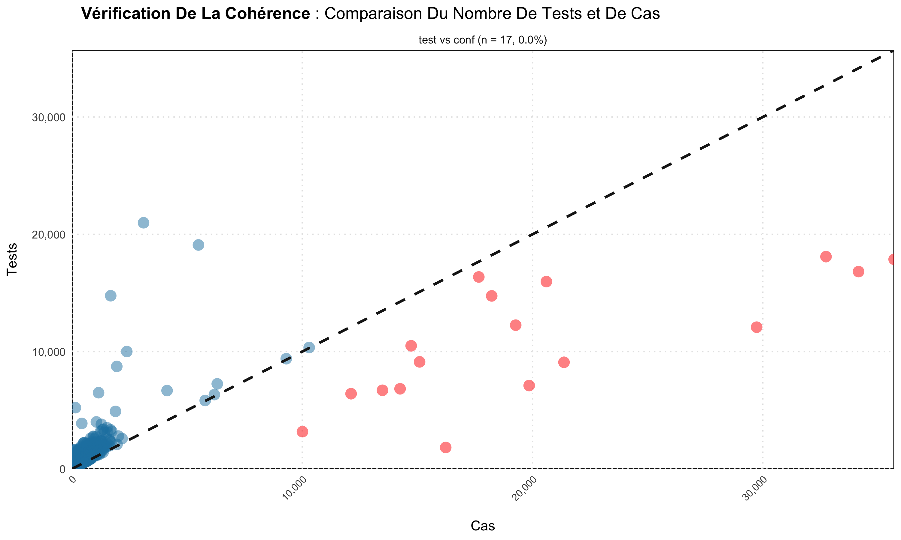
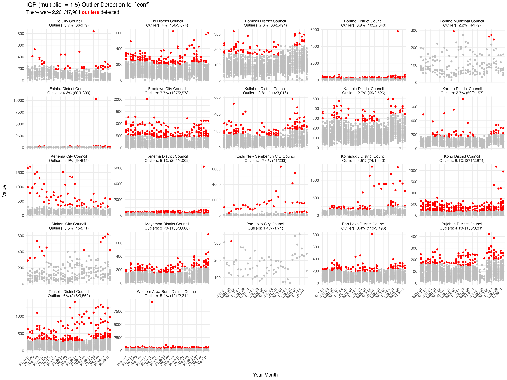
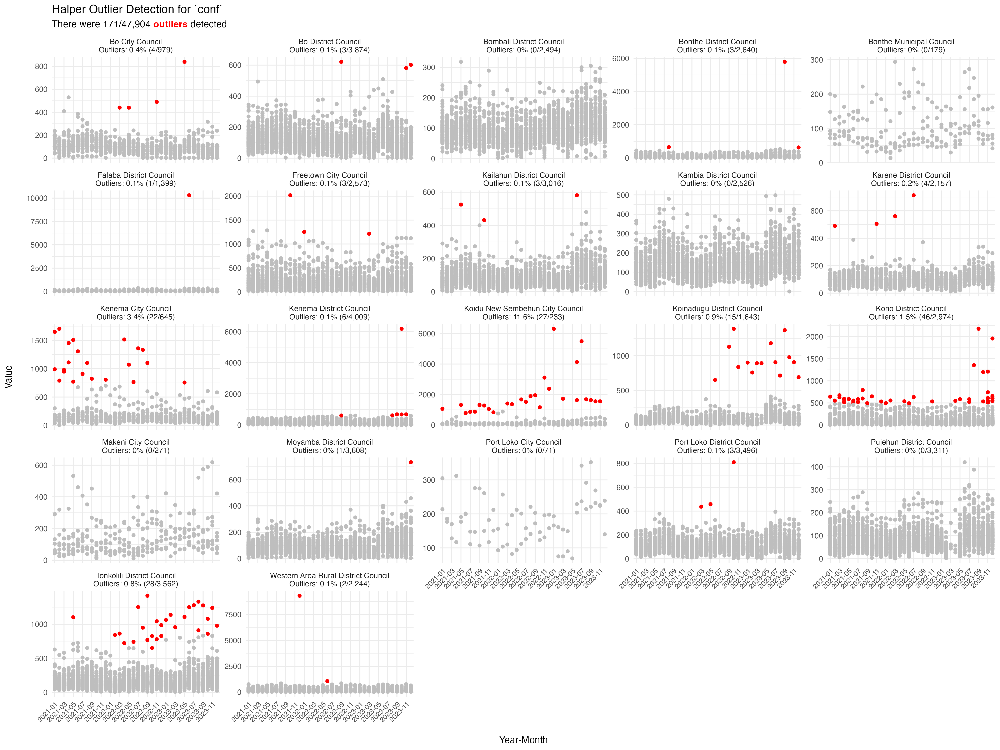
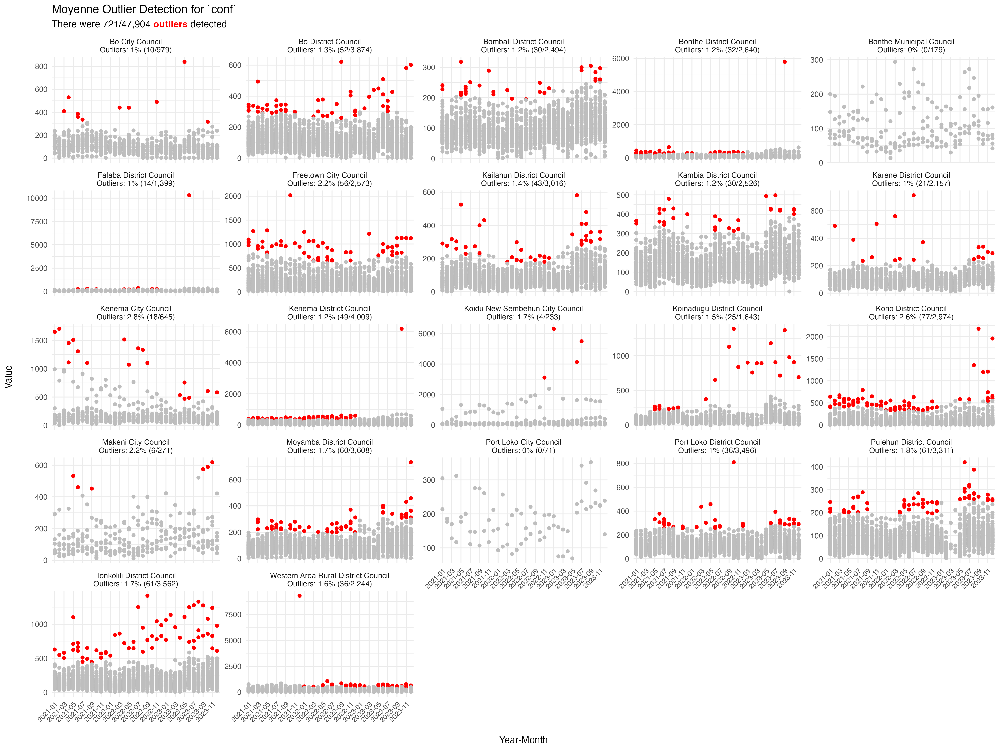

```{r, include = FALSE}
knitr::opts_chunk$set(
  collapse = TRUE,
  comment = "#>",
  eval = FALSE
)
```

Reporting completeness (covered in
[Reporting rates](reporting-rates.html)) tells us *whether* facilities
reported. This article covers the next two quality questions: are the
values they reported **internally consistent**, and are there
**outliers** that need correcting before modelling?

```r
library(sntutils)

sl_dhis2 <- read(
  system.file("extdata", "sl_exmaple_dhis2.rds", package = "sntutils")
) |>
  dplyr::rename(year_mon = date) |>
  dplyr::filter(year_mon >= "2020.01") |>
  dplyr::mutate(
    hf_uid    = vdigest(paste0(adm1, adm2, hf), algo = "xxhash32"),
    record_id = vdigest(paste(hf_uid, year_mon),  algo = "xxhash32")
  )
```

::: {.alert .alert-info}
**For the methodology and conceptual background behind the steps in this article, please check the [SNT Code Library](https://ahadi-analytics.github.io/snt-code-library/):**

- [Quality control (consistency checks)](https://ahadi-analytics.github.io/snt-code-library/english/library/data/routine_cases/quality_control.html) - cascade logic and red flags.
- [Outlier detection](https://ahadi-analytics.github.io/snt-code-library/english/library/data/routine_cases/outlier_detection.html) - when to use mean, median or IQR rules.
- [Outlier correction](https://ahadi-analytics.github.io/snt-code-library/english/library/data/routine_cases/outlier_correction.html) - decision rules for replacing flagged values.
- [Missing data](https://ahadi-analytics.github.io/snt-code-library/english/library/data/routine_cases/missing_data.html) - patterns and what to do about them.
- [Imputation](https://ahadi-analytics.github.io/snt-code-library/english/library/data/routine_cases/imputation.html) - replacement strategies in context.
:::

## Consistency checks

The malaria care cascade has a fixed direction: **outpatients ≥
suspected ≥ tested ≥ confirmed ≥ treated**, and **admissions ≥
malaria admissions ≥ malaria deaths**. `consistency_check()` flags
facility-months that violate any of these and renders a scatter of
input vs output with the violating points highlighted.

Common cascade checks include:

- All outpatients ≥ suspected malaria
- Malaria tests ≥ confirmed cases
- Confirmed cases ≥ cases treated
- All admissions ≥ malaria admissions
- Malaria admissions ≥ malaria deaths

```r
# tests (inputs) vs confirmed cases (outputs)
consistency_check(
  sl_dhis2,
  inputs  = c("test"),
  outputs = c("conf")
)

# save the plot
consistency_check(
  sl_dhis2,
  inputs    = c("test"),
  outputs   = c("conf"),
  save_plot = TRUE,
  plot_path = "plots/consistency_check_plots"
)

# translated labels (French)
consistency_check(
  sl_dhis2,
  inputs          = c("test"),
  outputs         = c("conf"),
  target_language = "fr"
)

# multiple cascades at once
consistency_check(
  sl_dhis2,
  inputs          = c("test", "conf", "alladm"),
  outputs         = c("conf", "maltreat", "maladm"),
  target_language = "fr"
)
```



### Mapping consistency

`consistency_map()` renders a choropleth of cascade-violation rates by
admin unit - useful for spotting whether the cascade is breaking in
particular districts vs. system-wide:

```r
consistency_map(
  data       = sl_dhis2,
  shapefile  = sle_adm2_clean,
  input_var  = "test",
  output_var = "conf",
  adm_var    = "adm2",
  x_var      = "year",
  language   = "en"
)
```

## Outlier detection

`detect_outliers()` flags unusual values in a numeric column using
three complementary methods, with detection done **within groups** of
admin unit × facility × year so seasonal and contextual variation
isn't mistaken for noise:

- **Mean ± 3 SD** - classic, parametric, sensitive to extremes.
- **Median ± 15 × MAD** - robust, the workhorse for surveillance data.
- **Tukey's fences** - quartile-based, tunable via `iqr_multiplier`.

```r
outlier_results <- detect_outliers(
  data       = sl_dhis2,
  column     = "conf",
  yearmon    = "year_mon",
  record_id  = "record_id",
  adm1       = "adm1",
  adm2       = "adm2",
  iqr_multiplier = 2
)

outlier_results |>
  dplyr::select(record_id, value, outliers_iqr, outliers_median, outliers_mean) |>
  utils::tail()
#> # A tibble: 6 × 5
#>   record_id value outliers_iqr outliers_median outliers_mean
#>   <chr>     <dbl> <chr>        <chr>           <chr>
#> 1 e8947016    321 normal value normal value    normal value
#> 2 28b6ea90    353 normal value normal value    normal value
#> 3 8aa281d9    246 normal value normal value    normal value
#> 4 8b337b53    305 normal value normal value    normal value
#> 5 7358f600    284 normal value normal value    normal value
#> 6 499f0390    309 normal value normal value    normal value
```

The output has one row per record. Join back on `record_id` and filter
or correct as needed.

### Visualising outliers

`outlier_plot()` returns a list of `ggplot` objects - one per method -
faceted by district and coloured by status. Facet labels show the
share of outliers in each district.

```r
plots <- outlier_plot(
  data      = sl_dhis2,
  column    = "conf",
  record_id = "record_id",
  adm1      = "adm1",
  adm2      = "adm2",
  yearmon   = "year_mon",
  methods   = c("iqr", "median", "mean")
)

plots$iqr
```



```r
plots$median
```



```r
plots$mean
```



## Correcting outliers and imputing missingness

Once outliers are identified, `correct_outliers()` replaces flagged
values using one of several strategies:

```r
sl_corrected <- correct_outliers(
  data        = sl_dhis2,
  outliers    = outlier_results,
  column      = "conf",
  method      = "moving_average",
  flag_method = "iqr"
)
```

The supporting functions:

- `impute_outlier_ma()` - moving-average imputation; the workhorse
  inside `correct_outliers()` when `method = "moving_average"`.
- `impute_higher_admin()` - borrow strength from the parent admin unit
  when the facility's own history is too sparse to support a
  within-unit estimate.
- `fallback_diff()`, `fallback_row_sum()`, `safe_sum()` - defensive
  numerical helpers used inside the imputation paths. They tolerate
  all-NA rows, return zeros where appropriate, and refuse to silently
  sum characters.

## A quality pipeline, end to end

```r
# 1. cascade consistency at the facility-month level
cascade <- consistency_check(
  data      = sl_dhis2,
  inputs    = c("test", "conf"),
  outputs   = c("conf", "maltreat"),
  show_plot = FALSE
)

# 2. detect outliers on confirmed cases
outliers <- detect_outliers(
  data      = sl_dhis2,
  column    = "conf",
  yearmon   = "year_mon",
  record_id = "record_id",
  adm1      = "adm1",
  adm2      = "adm2"
)

# 3. correct using a moving average, flagged by the robust median rule
sl_clean <- correct_outliers(
  data        = sl_dhis2,
  outliers    = outliers,
  column      = "conf",
  method      = "moving_average",
  flag_method = "median"
)
```

The output is `sl_clean` - same shape as the input but with
flagged-and-replaced values - plus diagnostic objects (`cascade`,
`outliers`) you can hand to reviewers as evidence for why each record
was edited.
