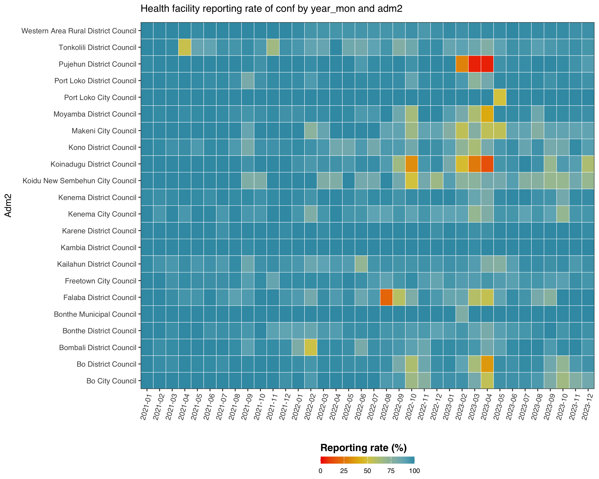
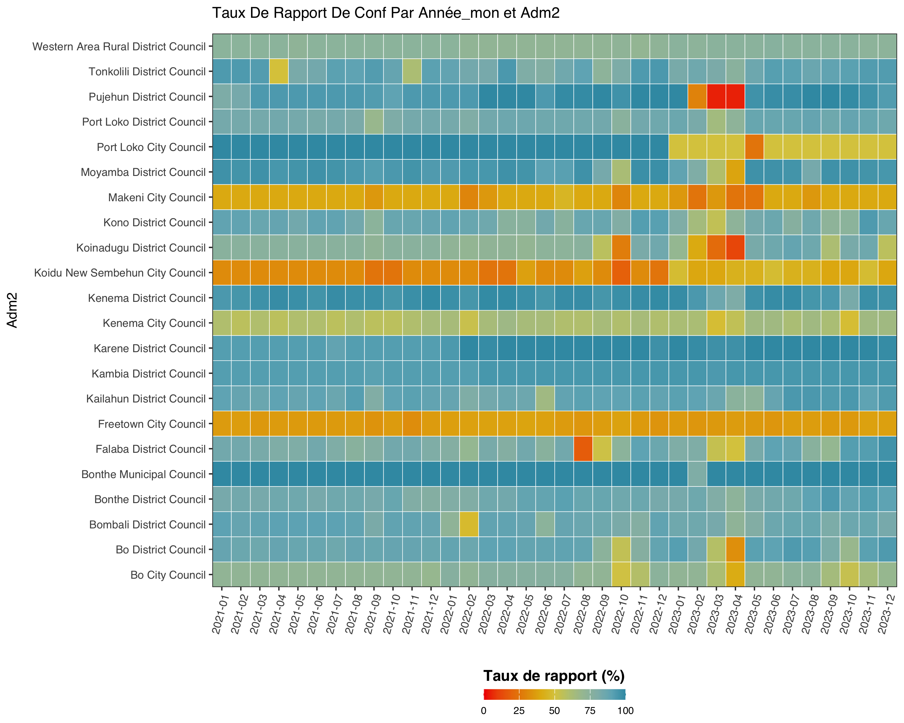
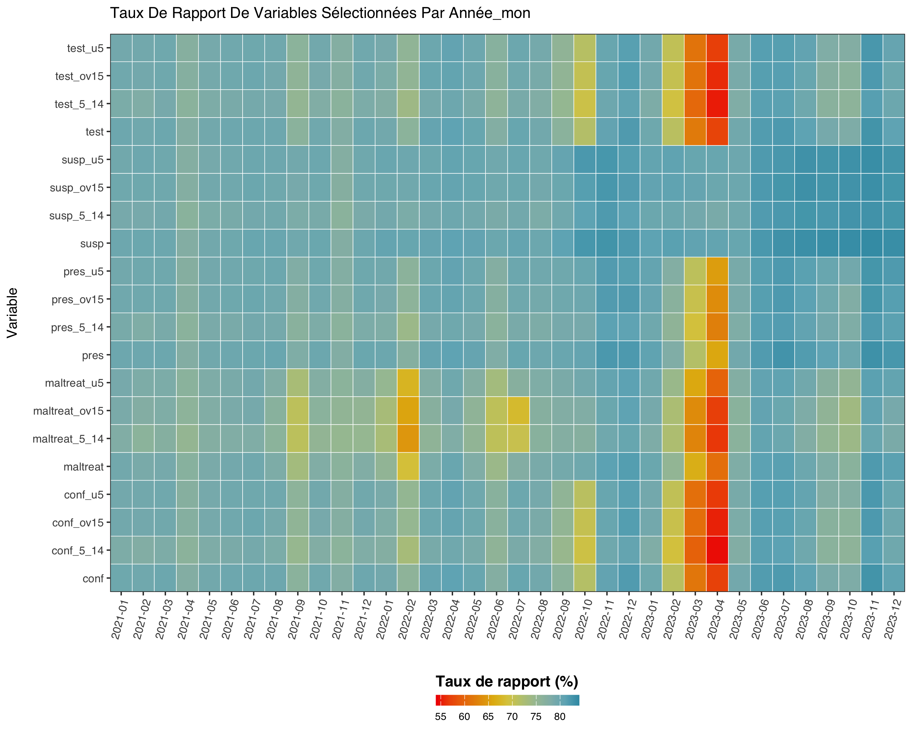

```{r, include = FALSE}
knitr::opts_chunk$set(
  collapse = TRUE,
  comment = "#>",
  eval = FALSE
)
```

::: {.alert .alert-info}
**Conceptual reading - SNT Code Library**

- [Reporting rates](https://ahadi-analytics.github.io/snt-code-library/english/library/data/routine_cases/reporting_rate.html) - what reporting rate measures and how to interpret it.
- [Active facility status](https://ahadi-analytics.github.io/snt-code-library/english/library/data/routine_cases/active_status.html) - the denominator logic in plain English.
:::

Before any stratification, trend analysis or modelling step, an SNT
analyst needs to know **how completely facilities are reporting**.
`calculate_reporting_metrics()` is the workhorse: it answers the
"who reported, when, where" question in three different shapes.

For the related question - are the values they reported internally
consistent and free of outliers - see the
[Data quality](data-quality.html) article.

We use the Sierra Leone DHIS2 sample shipped with the package
throughout.

```r
library(sntutils)

sl_dhis2 <- read(
  system.file("extdata", "sl_exmaple_dhis2.rds", package = "sntutils")
) |>
  dplyr::rename(year_mon = date) |>
  dplyr::filter(year_mon >= "2020.01") |>
  dplyr::mutate(
    hf_uid    = vdigest(paste0(adm1, adm2, hf), algo = "xxhash32"),
    record_id = vdigest(paste(hf_uid, year_mon),  algo = "xxhash32")
  )
```

## What "reporting rate" actually means here

`calculate_reporting_metrics()` computes the completeness of routine
reporting by checking whether health facilities have submitted valid
data for a specified set of indicators over time. It calculates rates
for one or more **target variables** (`vars_of_interest`) against an
expectation set defined by the **key indicators** (`key_indicators`).

A facility counts as **reporting** in a given year-month if any of the
selected `vars_of_interest` is non-missing. A facility is included in
the **denominator** for a given year-month only if it has already
reported on any of the `key_indicators` at or before that month. This
prevents newly-opened facilities from dragging the historic
non-reporting rate down.

Let:

- $a$ - administrative unit (e.g. district)
- $t$ - time period (year-month)
- $f$ - facility in $a$
- `key_indicators` - variables used to determine whether a facility is
  active, e.g. `"test"`, `"treat"`, `"conf"`, `"pres"`, `"allout"`
- `vars_of_interest` - variables we want the reporting rate **for**,
  e.g. `"conf"`, `"pres"`

The reporting rate for unit $a$ in period $t$ is

$$
\text{Reporting Rate}_{a,t} \;=\; \frac{o_{a,t}}{e_{a,t}}
$$

where

- $o_{a,t}$ - facilities in $a$ that reported **any** value in
  `vars_of_interest` during $t$
- $e_{a,t}$ - facilities in $a$ whose **first-ever** report on any
  `key_indicators` occurred on or before $t$.

### Worked example

Suppose we want the reporting rate for district $d$ in March:

- 6 facilities in $d$
- all 6 have first-reported on at least one key indicator on or before
  March
- 4 of them reported on `"conf"` in March

$$
\text{Reporting Rate}_{d,\text{Mar}} \;=\; \frac{4}{6} \;=\; 0.667
$$

## Scenario 1 - Facility-level reporting / missing rate

This is the rate you almost always want when reporting to a country
team. It uses an evolving denominator (facilities that have ever
reported) so the early months of a new system aren't punished.

```r
calculate_reporting_metrics(
  data             = sl_dhis2,
  vars_of_interest = c("conf", "pres"),
  x_var            = "year_mon",
  y_var            = "adm2",
  hf_col           = "hf_uid",
  key_indicators   = c("allout", "test", "treat", "conf", "pres")
) |>
  utils::tail()
#> # A tibble: 6 × 6
#>   year_mon adm2                                  rep   exp reprate missrate
#>   <chr>    <chr>                               <int> <int>   <dbl>    <dbl>
#> 1 2023-12  Moyamba District Council              106   108   0.981   0.0185
#> 2 2023-12  Port Loko City Council                  2     2   1       0
#> 3 2023-12  Port Loko District Council             99   103   0.961   0.0388
#> 4 2023-12  Pujehun District Council               96   104   0.923   0.0769
#> 5 2023-12  Tonkolili District Council            109   115   0.948   0.0522
#> 6 2023-12  Western Area Rural District Council    62    64   0.969   0.0312
```

The plot version is `reporting_rate_plot()` with the same arguments:

```r
reporting_rate_plot(
  data             = sl_dhis2,
  vars_of_interest = "conf",
  x_var            = "year_mon",
  y_var            = "adm2",
  hf_col           = "hf_uid",
  key_indicators   = c("allout", "test", "treat", "conf", "pres")
)
```



## Scenario 2 - Reporting rate by two dimensions

When we want a heatmap of completeness across time × space for one or
more variables, without the activity-based denominator, drop `hf_col`
and `key_indicators`:

```r
calculate_reporting_metrics(
  data             = sl_dhis2,
  vars_of_interest = c("conf", "pres"),
  x_var            = "year_mon",
  y_var            = "adm2"
) |>
  utils::head()
#> # A tibble: 6 × 7
#>   year_mon adm2                     variable   exp   rep reprate missrate
#>   <chr>    <chr>                    <chr>    <int> <int>   <dbl>    <dbl>
#> 1 2021-01  Bo City Council          conf        39    28   0.718   0.282
#> 2 2021-01  Bo City Council          pres        39    28   0.718   0.282
#> 3 2021-01  Bo District Council      conf       129   113   0.876   0.124
#> 4 2021-01  Bo District Council      pres       129   113   0.876   0.124
#> 5 2021-01  Bombali District Council conf        81    73   0.901   0.0988
#> 6 2021-01  Bombali District Council pres        81    73   0.901   0.0988
```

And the matching plot, this time with French labels:

```r
reporting_rate_plot(
  data             = sl_dhis2,
  vars_of_interest = "conf",
  x_var            = "year_mon",
  y_var            = "adm2",
  target_language  = "fr"
)
```



## Scenario 3 - Reporting rates over time

To see when each variable starts being reported (and where it stops),
drop `y_var` entirely:

```r
vars <- c(
  "test", "test_u5", "test_5_14", "test_ov15",
  "susp", "susp_u5", "susp_5_14", "susp_ov15",
  "pres", "pres_u5", "pres_5_14", "pres_ov15",
  "conf", "conf_u5", "conf_5_14", "conf_ov15",
  "maltreat", "maltreat_u5", "maltreat_5_14", "maltreat_ov15"
)

reporting_rate_plot(
  sl_dhis2,
  full_range       = FALSE,
  vars_of_interest = vars,
  x_var            = "year_mon",
  target_language  = "fr"
)
```



## Date-based reporting

`calculate_reporting_metrics_dates()` is the variant for facility
registries that record opening and closing dates rather than
month-by-month reporting. It computes the share of facilities active
in each period from `start_col` / `end_col` columns.

## Mapping reporting rates

`reporting_rate_map()` joins the metrics tibble to an admin shapefile
and renders a small-multiples map. It accepts everything
`calculate_reporting_metrics()` does, plus an `sf` argument:

```r
reporting_rate_map(
  data            = sl_dhis2,
  shapefile       = sle_adm2_clean,
  adm_var         = "adm2",
  vars_of_interest = "conf",
  x_var           = "year",
  hf_col          = "hf_uid",
  key_indicators  = c("allout", "test", "treat", "conf", "pres"),
  target_language = "en"
)
```

### Or roll your own: `facetted_map_gradient()`

`reporting_rate_map()` is the one-stop shortcut. When we want full
control over the colour scale, facets, or pre-filtered subsets, the
lower-level `facetted_map_gradient()` takes a tibble of metrics and an
`sf` boundary and draws the same kind of small-multiples map. Pair it
with `calculate_reporting_metrics()` directly:

```r
rates_by_year <- calculate_reporting_metrics(
  data             = sl_dhis2,
  vars_of_interest = c("conf", "pres"),
  x_var            = "year",
  y_var            = "adm2",
  hf_col           = "hf_uid",
  key_indicators   = c("allout", "test", "treat", "conf", "pres")
)

facetted_map_gradient(
  data      = rates_by_year,
  sf_data   = sle_adm2_clean,
  facet_col = "year",
  fill_col  = "reprate",
  join_by   = c("adm2" = "adm2_name"),
  limits    = c(0, 1),
  palette   = "ahadi_cool",
  title     = "Reporting completeness for `conf` - Sierra Leone",
  caption   = "Denominator: facilities ever-reporting on key indicators."
)
```

Use `facetted_map_bins()` instead when the metric is more naturally
read in categories (e.g. 0-50% red, 50-80% amber, 80-100% green):

```r
facetted_map_bins(
  data      = rates_by_year,
  sf_data   = sle_adm2_clean,
  facet_col = "year",
  fill_col  = "reprate",
  join_by   = c("adm2" = "adm2_name"),
  bins      = c(0, 0.5, 0.8, 0.95, 1),
  bin_labels = c("<50%", "50-80%", "80-95%", ">=95%"),
  title     = "Reporting completeness band, by district"
)
```

## Facility activity classification

For deeper diagnostics, `classify_facility_activity()` labels each
facility-month as **active**, **inactive**, **never-reported** or
**discontinued**, using a configurable rolling window.
`facility_reporting_plot()` then renders a tiled timeline so we can
spot facilities that stopped reporting in mid-2022 or never came
online:

```r
hf_status <- classify_facility_activity(
  data             = sl_dhis2,
  hf_col           = "hf_uid",
  x_var            = "year_mon",
  vars_of_interest = c("conf", "pres", "test"),
  nonreport_window = 6
)

facility_reporting_plot(
  hf_status,
  facet_by = "adm2"
)
```

`get_active_facilities()` returns just the active subset, ready to
feed back into a filtered analysis.

`compare_methods_plot()` lets us compare two reporting-rule choices
(e.g. *any* indicator vs *all* indicators) on the same data.

`validate_routine_hf_data()` is the upstream sanity check - it runs a
battery of structural checks on a routine HF dataset (required
columns, parseable dates, plausible value ranges) before any of the
reporting-rate functions get to it. Run it once at ingest.

## A reporting-rate pipeline, end to end

```r
# 1. structural validation
validate_routine_hf_data(
  data       = sl_dhis2,
  hf_col     = "hf_uid",
  date_col   = "year_mon",
  vars       = c("conf", "pres", "test")
)

# 2. district-month reporting rates for the variables we'll model on
rates <- calculate_reporting_metrics(
  data             = sl_dhis2,
  vars_of_interest = c("conf", "pres"),
  x_var            = "year_mon",
  y_var            = "adm2",
  hf_col           = "hf_uid",
  key_indicators   = c("allout", "test", "treat", "conf", "pres")
)

# 3. facility-level activity so we can mask non-reporting facilities later
activity <- classify_facility_activity(
  data             = sl_dhis2,
  hf_col           = "hf_uid",
  x_var            = "year_mon",
  vars_of_interest = c("conf", "pres", "test"),
  nonreport_window = 6
)

# 4. map of completeness in French, ready for the country-team report
reporting_rate_map(
  data            = sl_dhis2,
  shapefile       = sle_adm2_clean,
  adm_var         = "adm2",
  vars_of_interest = "conf",
  x_var           = "year",
  hf_col          = "hf_uid",
  key_indicators  = c("allout", "test", "treat", "conf", "pres"),
  target_language = "fr"
)
```

`rates` and `activity` are the inputs the
[Data quality](data-quality.html) article picks up from here.
